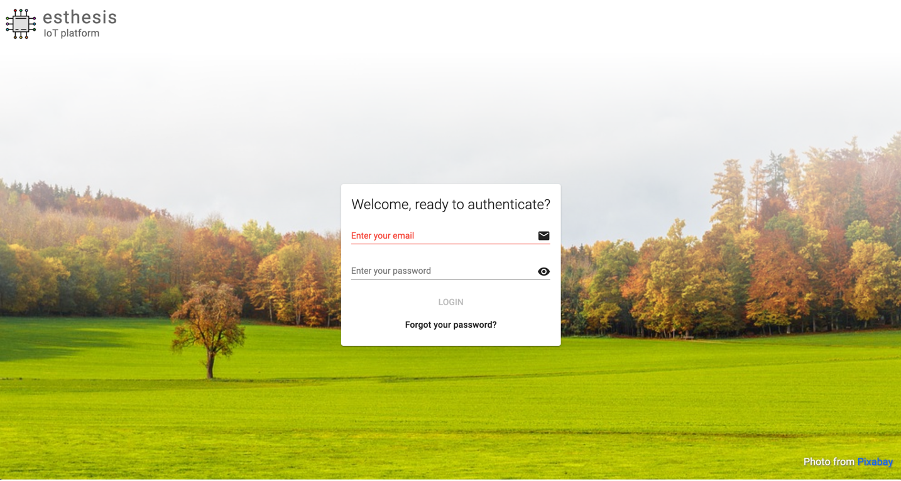
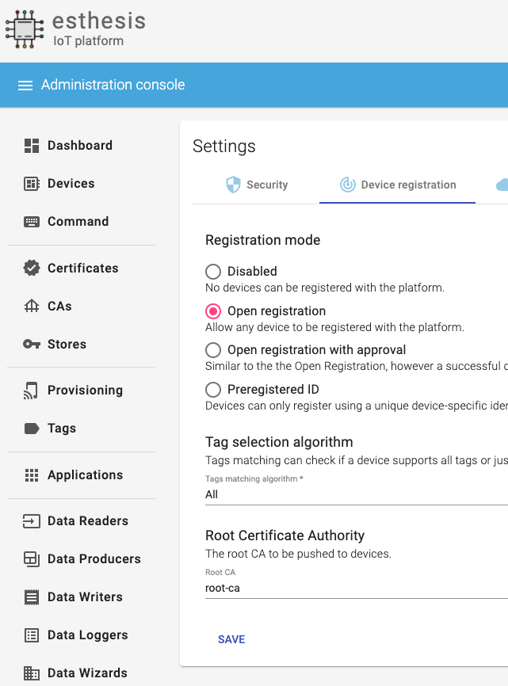
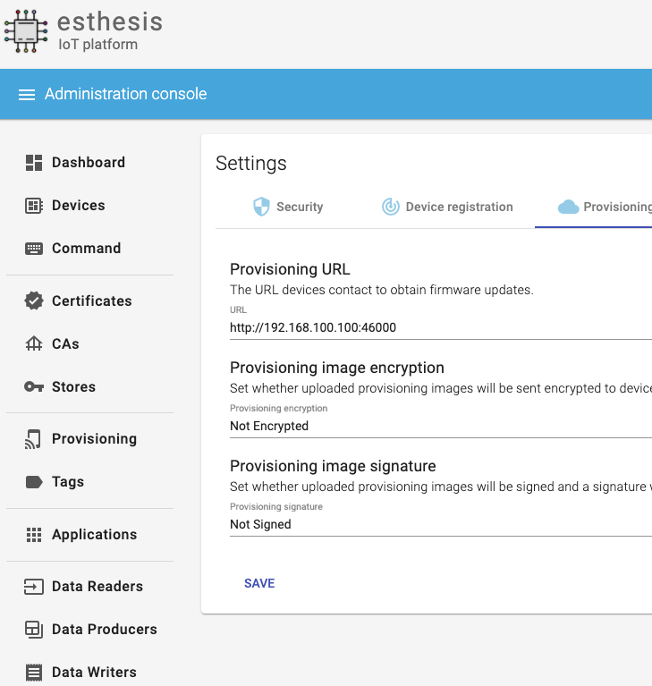
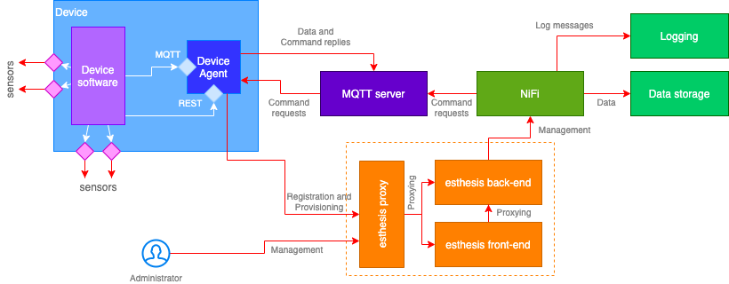

= esthesis IoT platform
Doc Writer <esthesis@eurodyn.com>
:toc:
:toclevels: 2
:homepage: https://esthesis.com
:icons: font
:sectanchors:
:sectlinks:

_esthesis_ is a modern Internet of Things platform, providing end-to-end management services
for your devices. It consists of device management functionality, over-the-air firmware upgrade
services, and a modular data-management approach. Built-in support for certificates and certificate
authorities allows you to effortlessly set up a secure communication environment with your devices where
provisioning packages can be signed and/or encrypted on the fly.

== Installation
Installation is based on public Docker containers, so you can setup your own _esthesis_ environment
quickly and with minimal effort. A Docker Compose file is provided so that you can setup all the
necessary infrastructure from scratch:

.Support services
* **A MySQL database**, acting as the main database of the platform. It stores information about the
devices, users, provisioning packages, etc., but not any device telemetry data.
* **An Apache NiFi instance**, acting as the data management and data distribution layer.
* **An Eclipse Mosquitto MQTT server**, providing the necessary infrastructure for device communication.
* **An InfluxDB database**, to store device telemetry data.
* **An NGINX reverse proxy**, to expose _esthesis_ services.

.Main services
* **esthesis platform backend server**, the server component of the platform.
* **esthesis platform frontend**, a web-based frontend for users to manage the platform.

While 'main services' are necessary for _esthesis_ to function, everything provided by the 'support services'
is optional, so you can replace it with your own locally managed installations. In the following sections
you can find examples of both approaches.

TIP: Depending on your bandwidth and Docker Engine's host performance, it might take a few minutes
for the platform to be up and running. In a typical environment, the platform should be accessible
within 5-10 minutes.

=== Installation options

==== All-in-one installation
This installation is the quickest way to go from an empty system to a fully-functional _esthesis_
platform in just a few minutes. It will create, link and configure all necessary Docker
containers to provide all the support and main services for you.

You can perform an all-in-one installation issuing the following command:

```
curl -Ls https://cutt.ly/esthesis | \
DB_PORT=45000 \
MYSQL_ROOT_PASSWORD=root \
MYSQL_USER=esthesis \
MYSQL_PASSWORD=esthesis \
MYSQL_DATABASE=esthesis \
PORT_MQTT=1883 \
PORT_MQTT_SECURE=8883 \
INFLUXDB_DB=esthesis \
INFLUXDB_ADMIN_USER=admin \
INFLUXDB_ADMIN_PASSWORD=admin \
NIFI_WEB_PROVIDERS_PORT_LOW=20000 \
NIFI_WEB_PROVIDERS_PORT_HIGH=20100 \
NIFI_WEB_UI=8080 \
PORT_ESTHESIS_BACKEND=46000 \
PORT_ESTHESIS_UI=8080 \
PORT_ESTHESIS_PROXY=80 \
docker-compose -p esthesis -f /dev/stdin up -d
```

The above command will fetch _esthesis_' https://raw.githubusercontent.com/esthesis-iot/esthesis-setup/master/docker/prod/docker-compose.yml[docker-compose file]
and setup all necessary containers with the configuration options you have specified above.

==== Selective services only installation
You can specify which specific services of _esthesis_ you need in your installation by takign advantage
of Docker Compose's built-in functionality to only start specific services. For example, if you want
to use your own resources instead of _esthesis_ 'supporting services' and only install _esthesis_
'main services', you can substitute `docker-compose -p esthesis -f /dev/stdin up -d` above with:

```
docker-compose -p esthesis -f /dev/stdin up -d esthesis-platform-backend-server esthesis-platform-ui
```

==== Manual installation
You can download the configuration options and the docker-compose file to change them in order to
perform a custom, manual installation:
https://raw.githubusercontent.com/esthesis-iot/esthesis-setup/master/docker/prod/docker-compose.yml[docker-compose file],
https://raw.githubusercontent.com/esthesis-iot/esthesis-setup/master/docker/prod/.env[.env file].
Once you have the files locally downloaded, you can proceed to the installation issuing the following command:
```
docker-compose -p esthesis up -d
```

=== Create Docker Network ===

TBC

=== Post-installation steps
==== Check containers status
As soon as all Docker containers have been initialised you can start using _esthesis_. You can monitor the status of your deployment using:

```
docker ps --format 'table {{.Names}}\t{{.Status}}' | grep esthesis
```

Before all containers ready:

image::images/image-2020-12-02-15-41-53-256.png[]

After all containers ready:

image::images/image-2020-12-02-16-36-07-141.png[]

Once all containers are reported as `healthy` you can login to _exthesis_.

==== Web location and admin account
Using the default configuration options of _esthesis_, the frontend application is available on
port 80 of your Docker Engine host. For example, http://my-esthesis-host.

The default administration credentials are:
```
Username: admin@esthes.is
Password: admin
```

WARNING: You should change the default credentials as soon as possible to prevent unauthorised access to your platform.

== Quick start

This section will guide you through some basic configuration options once you have a new installation
of _esthesis_ up and running. Please take into account that the configuration options presented here are
probably not what you should be using in production, so you may need to tweak them to your
organisation's requirements before you expose _esthesis_ services to untrusted networks.

=== Create a certificate authority
image::images/image-2020-12-03-18-46-36-611.png[alt="Creating a certificate authority"]
* Navigate to `Certificate Authorities`.
* Create a new certificate authority, leaving the `Parent CA` option empty.

=== Create a platform certificate
image::images/image-2020-12-03-18-47-35-834.png[alt="Creating a certificate"]
* Navigate to `Certificates`.
* Create a new certificate choosing the certificate authority created above as `Signed by`.

=== Platform settings - security
image::images/image-2020-12-03-18-48-16-642.png[]
* Navigate to `Settings` > `Security`.
* Set the Platform certificate to the certificate you created above.

=== Platform settings - Device registration

* Navigate to `Settings` > `Device registration`.
* Set Registration mode to `Open registration`.
* Set Root Certificate Authority to the one you created above.

=== Platform settings - Provisioning


* Navigate to `Settings` > `Provisioning`.
* Set Provisioning URL to the address where _esthesis_ platform proxy container is accessible from.

=== Create a tag
image::images/image-2020-12-03-18-54-31-746.png[]
* Navigate to `Tags`.
* Create a tag you can associate resources with.

=== Register and synchronise NiFi
image::images/image-2020-12-03-18-55-03-693.png[]
* Navigate to `Infrastructure` > `NiFi`.
* Register the NiFi server to be used by _esthesis_.
* Once NiFi is registered, open on the newly created instance and click on `Synchronise`. Synchronisation
will take a few seconds; you can monitor the progress bar on top of your screen. Once synchronisation
is completed, you will be automatically redirected back to the list of NiFi servers.

=== Register the MQTT server
image::images/image-2020-12-03-18-57-55-497.png[]
* Navigate to `Infrastructure` > `MQTT`.
* Register the MQTT server to be used by _esthesis_, associating it with the tag you created before.

=== Setup Data sinks
image::images/image-2020-12-03-18-59-41-472.png[]
For the purpose of a quick setup, the Data Wizards functionality will be used.

* Navigate to `Data Wizards`.
* Select `Standard infrastructure` and click on `Next`.
* Fill-in the standard infrastructure data wizard form. If you have installes _esthesis_ using the
provided Docker Compose file, you only need to change the address of your Docker engine and leave
the remaining values to their default values.
* Click on `Execute Wizard'. Once the progress bar is completed, your installation is fully configured.

=== Register a demo device
You can, optionally, register a demo device before you start using your real devices. _esthesis_
<<_device_agent>> is provided as a Docker container (on top of a standalone agent format), so you can use it to quickly fire up a virtual demo device. To start your demo device, issue a command similar
to:
```
docker run --name esthesis-demo-device --network=esthesis_esthesis-prod -d  \
-e hardwareId=device1 \
-e storageRoot="/app" \
-e tags=test1 \
-e registrationUrl="http://my-esthesis-host:port" \
esthesis/device:2.0.1-SNAPSHOT
```

The demo device can also send random data, if configured accordingly. For demo data configuration see
<<dev-device-simulator>>.

To enable debug output on your demo device, you can add the following parameter:
```
-e logging.level.esthesis=trace
```

== User guide
TBC

== Device agent
The device agent is the piece of software that runs in your devices allowing you to seamlessly connect
and control them from _esthesis_ platform. _esthesis_ provides a device agent that you can use
right of the box to interconnect any device capable of running Java (future versions of the device
agent will support additional options).

This section presents the functionality as well as the configuration options of the device agent.

=== Configuration
The device agent comes with a plethora of configuration options to accommodate different hardware and
deployments as presented next. Mandatory parameters for the device agent to bootup properly are denoted with [red]#*#. Values in **bold** indicate default values.

.Commonly used parameters
[cols="1,^,1"]
|===
|Parameter |Value |Description

|hardwareId [red]#*#
|Alphanumeric
|An ID that uniquely identifies this device. See also <<_hardware_ids>>.

|pauseStartup
|true, **false**
|A flag indicating whether the device should start paused. A paused device requires a keyboard input
to resume booting, useful when debugging devices.

|provisioningForkType
|**soft**, hard
|A provisioning package contains a script that will be executed by the agent in order to
 initiate the actual provisioning process. This flag defines how such execution will take place:

 soft: The script is called as a child process, controlled by the runtime agent. As soon as the
       agent terminates, the provisioning script terminates too.

 hard: The script is called as an independent process, not controlled by the runtime agent.

|provisioningPostHook
|
|The script to be called after a provisioning package is downloaded.
The script is handed the following parameters:

1. The full pathname to the provisioning package.

2. Whether this is an initial provisioning or not (as a true/false value).

|provisioningRoot
|If empty, $storageRoot/provisioning
|The root folder to store remotely retrieved provisioning packages.

|provisioningTempRoot
|If empty, $storageRoot/provisioning/.tmp
|The root folder to temporarily download a remotely retrieved provisioning packages. Once the
 package is downloaded, it is moved to provisioningRoot.

|validateProvisioningChecksum
|**true**, false
|A flag indicating whether the agent should validate the checksum of the incoming provisiong
package.

|rebootCommand
|
|The command to be executed to reboot the device.

|registrationUrl
|
|The URL of the esthesis platform with which the device will attempt to register with. For example,
'http://my-esthesis-host.com'.

|secureStorageRoot
|If empty, $storageRoot
|The root folder under which secure persistent storage is provided.

|storageRoot [red]#*#
|
|The folder to store the agent's configuration and runtime files. For example, '/storage/esthesis'.

|tags
|
|A comma-separated list of tags for the device to present during registration.

|topicPing
|**esthesis/ping**
|The MQTT topic to send PING messages.

|topicTelemetry
|**esthesis/telemetry**
|The MQTT topic to send TELEMETRY messages.

|topicMetadata
|**esthesis/metadata**
|The MQTT topic to send METADATA messages.

|topicControlRequest
|**esthesis/control/request**
|The MQTT topic to listen for CONTROL REQUEST messages.

|topicControlReply
|**esthesis/control/reply**
|The MQTT topic to send CONTROL REPLY messages.

|skipInitialProvisioning
|**true**
| A flag for the device to skip initial provisioning, useful in case the device comes with a firmware image already installed during factory setup.

|skipRegistration
|**false**
|A flag indicating to skip the initial device registration with _esthesis_ platform, useful if you ship
devices already registered.

|supportedCommands
|**PROVISIONING_CHECK_NEW,
PING,
HEALTH,
REBOOT,
EXECUTE**
|A comma-separated list of commands this device supports.
|===

.Communication parameters
[cols="1,^,1"]
|===
|Parameter |Value |Description

|requestAttempts
|**100**
|The maximum number a request (to esthesis platform) is retried.

|requestMaxBackoff
|**60**
|The maximum number of minutes to wait between attempts of previously failed requests.

|requestRetryBackoff
|**1000**
|Number of milliseconds to wait before trying again a previously failed request.

|===

.Local services
[cols="1,^,1"]
|===
|Parameter |Value |Description

|proxyMqtt
|true, **false**
|A flag to indicate that the embedded MQTT-to-MQTT proxy server should be started.

|proxyMqttPort
|**4566**
|The port of the embedded proxy MQTT server.

|proxyWeb
|true, **false**
|A flag to indicate that the embedded web-to-MQTT proxy server should be started.

|proxyWebPort
|**4567**
|The port of the embedded proxy Web server.

|===

.Security parameters
[cols="1,^,1"]
|===
|Parameter |Value |Description

|asymmetricCipher
|**RSA/ECB/PKCS1Padding**
|The cipher used for asymmetric encryption/decryption

|asymmetricKeyAlgorithm
|**RSA**
|The algorithm the asymmetric keys (i.e. public and private keys) are created with.

|Whether incoming messages should be encrypted.
|true, **false**
|A flag indicating whether incoming messages should be encrypted.

|incomingSigned
|true, **false**
|A flag indicating whether incoming messages should be signed.

|outgoingEncrypted
|true, **false**
|A falg indicating whether outgoing messages are encrypted.

|outgoingSigned
|true, **false**
|A flag indicating whether outgoing messages are signed.

|provisioningEncrypted
|true, **false**
|A flag indicating whether incoming provisioning packages should be encrypted.

|provisioningSigned
|true, **false**
|A flag indicating whether incoming provisioning packages should be signed.

|signatureAlgorithm
|**SHA256withRSA**
|The algorithm to be used when signing messages.

|symmetricCipher
|**AES/CBC/PKCS5Padding**
|The cipher used for symmetric encryption/decryption.

|symmetricKeyAlgorithm
|AES
|The algorithm the symmetric key (i.e. the session key) is created with.

|===

.Health checks parameters
[cols="1,^,1"]
|===
|Parameter |Value |Description

|healthDataFreqMsec
|**3600000**
|How often health data from the node are transmitted back to the platform (in msec).

|healthDataInitialDelayMsec
|**3600000**
|How long to wait before starting transmitting health data (in msec).

|pingFreqMsec
|60000
|How often PING data is sent (in msec).

|pingInitialDelayMsec
|60000
|How long to wait before start sending ping data (in msec).

|hcOsManufacturer
|**true**, false
|Return manufacturer information in health messages.

|hcOsVersion
|**true**, false
|Return OS version information in health messages.

|hcHwSerial
|**true**, false
|Return hardware serial number information in health messages.

|hcCpuPhysicalPackage
|**true**, false
|Return the number of CPUs information in health messages.

|hcCpuPhysicalCores
|**true**, false
|Return the number of physical CPU cores information in health messages.

|hcCpuLogicalCores
|**true**, false
|Return the number of logical CPU cores information in health messages.

|hcCpuIdentifier
|**true**, false
|Return the CPU identifier information in health messages.

|hcCpuProcessorId
|**true**, false
|Return the CPU processor ID information in health messages

|hcCpuTemperature
|**true**, false
|Return the CPU temperature information in health messages.

|hcMemoryAvailable
|**true**, false
|Return the available memory information in health messages.

|hcMemoryTotal
|**true**, false
|Return the total memory information in health messages.

|hcLoad1
|**true**, false
|Return the load in the last 1' information in health messages.

|hcLoad5
|**true**, false
|Return the load in the last 5' information in health messages.

|hcLoad15
|**true**, false
|Return the load in the last 15' information in health messages.

|hcFs
|**true**, false
|Return information about filesystems usage in health messages.

|hcFilterFs
|
|A comma-separated list of filestystems to include in health messages. If left empty, all
discovered filesystems will be included.

|hcCurrentTime
|**true**, false
|Return the device's local clock date/time.

|hcUpTime
|**true**, false
|Returns the device's uptime in health messages.

|hcIpAddress
|**true**, false
|Returns the device's IP address in health messages.

|hcIpIfFilter
|
|A comma-separated list of interface names to include when reporting their IP address. If left
empty, all interfaces will be included.

|runtimeVersion
|**true**, false
|Returns the device's agent version in health messages.

|runtimeCommitId
|**true**, false
|Returns the commit ID of the runtime agent running on the device in health messages.

|firmwareVersionFile
|
|A file containing the firmware version to be reported. The contents of this file are read by the
agent and reported in health checks.
|===

[[demo-parameters]]
.Demo parameters
[cols="1,^,1"]
|===
|Parameter |Value |Description

|demo
|true, **false**
|A flag instructing the agent to submit random telemetry data.

|demoFreqMsec
|**5000**
|The period in which random data is generated and sent (in msec).

|demoInitialDelayMsec
|**5000**
|The amount of time to wait before the agent starts submitting random data (in msec).

|demoPayload
|{`"m": "demo", "v": { "temperature": %i%, "humidity": %f%}`
|The payload of the random data (see also <<dev-device-simulator>>).
|===

=== Installation
The device agent comes in the form of a self-contained Java JAR file. The JAR file encapsulates all
the runtime dependencies needed, so you can execute the agent just by obtaining the
`esthesis-platform-device.jar` file. To ease integration and, in particular, updates of the device
agent, the JAR filename does not contain a version information. However, detailed version information
is available within the JAR file (see Developer guide, <<dev-device-agent>>).

The device agent can be executed in your device using a command similar to:
```
hardwareId=device1 \
storageRoot="$(echo ~$USER)/.esthesis" \
registrationUrl=http://my-esthesis-host \
java -jar target/esthesis-platform-device.jar
```

_esthesis_ comes with a Device Simulator to let you test your installation. To use the Device simulator, see <<dev-device-simulator>>.

The device agent is also available as a Docker container, for environment with a containers runtime:
https://hub.docker.com/repository/docker/esthesis/esthesis-platform-device

=== Embedded Web & MQTT servers
The device agent embeds a locally-exposed Web server and an MQTT server. These local servers act like a proxy between your device's custom software and the esthesis back-end platform, providing a communication channel to securely transmit your device/sensor data:

.Device agent embedded servers
image::diagrams/device-agent-embedded-servers-1.png[]

Once you have collected data by your custom device softwate, you can utilise the embedded device
agent servers to let esthesis securely transfer them to your back-end infrastructure. Your custom
software does not need to be aware of URLs, IP address, or any other infrastructure-related
information that might change. It only needs to communnicate with the locally available servers
using `localhost` or `127.0.0.1`. It is the responsibility of the device agent to get your payload
and forward it:

.Wrapping custom payloads to esthesis messages
image::diagrams/device-agent-emedded-servers-2.png[]

==== Embedded Web server
The embedded web server listens, by default, on port 4567 (the port can be changed in device agents'
configuration parameters). You can push your own payload to the embedded web server in the following
two channels:


==== Embedded MQTT server
TBC


=== Additional information
You can find additional information on the device agent in the following sections:

* For an architectural point of view, see <<architecture-device-agent, Architecture - Device agent>>.
* For a developer's point of view, see <<dev-device-agent, Developer Guide - Device agent>>.

== Developer guide
The following sections provide information for software developers that might want to work with
_esthesis_ to extend its functionality.

=== Architecture
_esthesis_ is an IoT platform. Admittedly, this is a broad definition and may include, or not include,
different things according to the context in which it is being used. In high-level terms, in an IoT
environment you would expect to have devices that collect data. The data needs to be transmitted
to a data collection endpoint and then, eventually, persist into a data storage:

.Basic concepts of an IoT platform
image::diagrams/architecture1.png[]

_esthesis_ takes a holistic approach towards devices and data management by utilising state of the
art, mature tools and building the necessary IoT management on top.

The main architectural components of _esthesis_ consist of the following building blocks:

* A front-end, web-based application to manage _esthesis_.
* A back-end application, to provide services necessary to the front-end as well as to devices.
* A device agent, to provide connectivity to remote devices.
* An MQTT server to communicate with devices.
* An Apache NiFi server to provide dataflow management services.

The following figure presents the main building blocks of _esthesis_ as well as the interconnection
between them:

.Architectural building blocks of _esthesis_


The following sections provide an overview of the role of each building block into _esthesis_ IoT platform.

==== _esthesis_ proxy, front-end, and back-end
The _esthesis_ front-end and back-end are the core building blocks delivering the functionality of
_esthesis_ IoT platform. Access to both componets is provided via a reverse proxy, delivering in the
form of a Docker container as part of the _esthesis_ deployment.

The front-end block, provides the user interface of _esthesis_ platform. It is a modern, Single Page Application, compatible with all major Internet browsers.

The back-end block, provides the services necessary to fetch information to the front-end block as
well as services geared towards devices.

==== Device agent [[architecture-device-agent]]
The device agent is the piece of software running within your device, allowing it to be remotely
managed. _esthesis_ comes with its own device agent that can be incorproated into your devices,
making them remotely managed with minimal effort.

The device agent is an autonomous piece of software, not aware of what kind of device is running on. Effectively, the device agent does not know what
kind of sensors your device has, what kind of data needs to be collected, or how access to sensors
providing the data is to be realised. Communication with device-specific sensors and data collection
is handled by other custom, device-specific software running on the device. Such software
can be a complex, elaborated solution you have created as part of your project, or just a simple cron-based script that polls your sensors and collects data.

Data from sensors that has been collected locally on the device has little value if they only stay
in the device itself. Eventually, you need all sensor data to be concentrated on a data storage, so that you can utilise it to deliver your added-value services. The _esthesis_ device agent provides two local communication channels within your device: An embedded MQTT server, and an embedded Web server. The configuration options of the device agent allows you to specify which of those two
channels become available and you can choose to have none, either, or both active.

The local endpoints provided by the device agent allow any local process to submit data simply by
using a `localhost` address. Your data collection scripts, or software, does not need to be aware
of _esthesis_. As soon as data is received on any device agent's endpoints, it is automatically
transmitted to _esthesis_. The device agent wraps your data into its own format and can optionally
encrypt and/or sign the final payload to be transmitted to _esthesis_.

The device agent comes as an integral part of the _esthesis_ IoT platform and can help you interconnect
your devices with minimal effort and time. It incorporates the complete set of services provided by _esthesis_, includign remote management, software updates, automatic and transparent data encryption
and signing, etc. However, if your needs dictacte a different implementation, or if the architecture
of your device is not supported by _esthesis_ runtime agent, you can create your own device agent. Admittedly, creating a device agent from scratch requires times and effort, however there is nothing
in _esthesis_ open architecture preventing you from doing so. You can find additional details on the
protocols and supported data flows of the device agent in the Developr Guide, <<dev-device-agent>> section.

==== MQTT server
The MQTT server is the building block providing bidirectional communication between devices and
_esthesis_ platform. _esthesis_ comes with an Eclipse Mosquitto MQTT, however you can use any other
compatible MQTT server. The MQTT design in _esthesis_ utilises five different topics to communicate
with devices as presented next:

.MQTT topics used with devices
image::diagrams/architecture3.png[]

The default topic names are depicted above, however topic names are configurable. If you wish to
change the topic names you need to do so in the configuration parameters of the device agent as
well as in the Data Reader data sinks of _esthesis_. The supported channels are:

* `esthesis/ping/{hardwareId}`: Heartbeat messages from devices. The frequency of each ping message,
when using the provided _esthesis_ device agent, is configurable. Direction: Device to _esthesis_ platform.
* `esthesis/telemetry/{hardwareId}`: Telemetry data submitted by the device. Direction: Device to _esthesis_ platform.
* `esthesis/metadata/{hardwareId}`: Metadata data submitted by the device. Direction: Device to _esthesis_ platform.
* `esthesis/control/reply/{hardwareId}`: Device response to a command previously received. Direction: Device to _esthesis_ platform.
* `esthesis/control/request/{hardwareId}`: Requests originating from _esthesis_ platform for the
device to execute a specific command. Direction: _esthesis_ platform to device.

For the exact format of each message payload, see <<dev-messaging-specs>>.

==== NiFi server
Apache Nifi is at the core of our design for the _esthesis_ platform. It is the layer where data
delivery and distribution takes place and it is fully managed by the _esthesis_ platform server.

_ethesis_ can work with the NiFi Docker Container it ships with, or plug into a NiFi instance you
might already have running. Once _esthesis_ plugs into a NiFi instance, it first deploys an
empty data workflow into that NiFi, as depicted below:

._esthesis_ top-level NiFi Process Group
image::images/image-2020-12-03-16-40-59-958.png[]

_esthesis_ creates a Process Group in the root of the NiFi instance and everything else in encapsulated
within that group, so it can co-exist with other already deployed processes without polluting any
infrastructure already in place.

As NiFi is fully managed by the _esthesis_ platform, an _esthesis_ administrator is not expected to
interact directly with NiFi. In fact, _esthesis_ was installed following the default installation
process, the web interface of NiFi is not becoming exposed.

Integration with NiFi is based on four different concepts as presented next:

image::images/image-2020-12-03-16-52-40-935.png[]

===== Readers
Readers are responsible for inbound data traffic. Data Readers, as named in _esthesis_ platform
administration user interface, allow the administrator to retrieve data from a variety of data sources.
You can start with a single instance, for example, an MQTT Data Reader to ingest data from your devices
and expand to any number of additional Data Readers as your devices fleet starts to grow and you
want to segregate the traffic. Data Readers can be of heterogenous nature and you can intermix
different types of technologies together, as long as messages adhere to _esthesis_ messaging protocol
(for protocol specifications, see <<dev-messaging-specs>>).

===== Writers
Writers are responsible for outbound data traffic. Data Writers, as named in _esthesis_ platform
aadministration user interface, allow the administration to specify where data persists when
routed through NiFi. You can persist the same piece of data to multiple different data sources at
once, for example, storing your telemetry values in a time-series database for long-term storage
while in parallel you send them to a Kafka cluster for real-time processing.

===== Producers
Producers are responsible to generate data replies by querying their underlying data sources. Data
Producers, as named in _esthesis_ platform administration user interface, allow the administrator
to define REST-enabled endpoints that can be queried from the _esthesis_ platform (and, effectiely,
by the end-users of the platform too). Data Producers, together with the Applications functionality
of the _esthesis_ platform, deliver the equivalent of a Digital Twin for your devices. You can have
multiple Data Producers which are transparently load-balanced by _esthesis_.

===== Loggers
Loggers are responsible to concentrate logging output from all processors deployed in NiFi. Data
Loggers, as named in _esthesis_ platform administration user interface, allow the administrator to
define the targets on which logging information is persisted to.

=== Development environment
.Main technical stack
* JDK 13.x
* Maven 3.6.x
* Spring Boot 2.x
* Angular 9

.Version control
https://github.com/esthesis-iot

Integration of new features takes place via GitHub's Pull Requests.

.Supporting Docker containers
There is a Docker Compose file, targeted to developers, allowing you to quickly setup the necessary supporting infrastructure to work with _esthesis_ source code under `esthesis-setup/docker/dev`.
The developers version is similar to the production one, however it locally exposes all contaier's
ports by default, it incorporates additiinal tools (like Chronograf, and a syslog server), and does
not boot up the _esthesis_ platform back-end and front-end components.

=== Data Sinks [[dev-data-sinks]]
TBC

=== Device agent [[dev-device-agent]]
TBC

==== Registration sequence
TBC

==== Provisioning sequence
TBC

=== Device simulator [[dev-device-simulator]]
A device simulator running the device agent is provided by _esthesis_ as a Docker container. You can
use the device simulator to test your installation or to simulate workloads to stress test your
environment.

You can see the embedded MQTT and WEB server of the device agent to post your own data. All data you
post via MQTT or REST will be automatically transferred to your registered _esthesis_ platform. However,
the device simulator is capable of producing random data for you. To enable this option, you can
utilise the following parameters: `demo`, `demoFreqMsec`, `demoInitialDelayMsec`, `demoPayload` (see <<demo-parameters>>).

The default payload of the random data that is transmitted as teleemetry values consists of the following JSON structure:
```
{
  "m": "demo",
  "v": {
     "temperature": %i%,
     "humidity": %f%
  }
}
```

The `%` placeholders denote variables that will be subtituted during message construction. In particular:

* `%i%` will be substituted with a random integer value from 0 to 100.
* `%f%` will be substituted with a random float value from 0 to 100.

==== Hardware IDs
_How to work with, how to find them [TBC]_

==== _esthesis_ messaging specifications [[dev-messaging-specs]]
_esthesis_ supports a simple, lightweight, JSON-based message payload. If you want to check the
validity of your JSON payloads, a JSON Schema is available at https://github.com/esthesis-iot/esthesis-platform/blob/master/esthesis-platform-backend/esthesis-platform-backend-server/src/main/resources/nifi/esthesis-data-schema.json.

The JSON payload consists of a key describing what kind of information the message contains,
followed by a key with one or more specific measurements. The nature of the message, whether it is
telemetry or metadata, is not part of the message content itself as this is denoted by the channel/topic on which the message was posted into.

.Single anonymous value
```
{
  "m": "temperature",
  "v": 12.3
}
```
This payload will create a measurement `temperature` with a variable name `value` having a value of `12.3`.

.Single named value
```
{
  "m": "climate",
  "v": {
    "temperature": 4,
  }
}
```
This payload will create a measurement `climate` with a variable named `temperature` having a value of `4`.

.Multiple named values
```
{
  "m": "climate",
  "v": {
    "temperature": 9.5,
    "humidity": 47
  }
}
```
This payload will create a measurement `climate` with two variables, a variable named `temperature` having a value of `9.5`, and a variable named `humidity` having a value of `47`.


===== PING message example
```
{
  "m": "ping",
  "v": 1607015126194
}
```
This is the standard format of the PING message type payload. The value is expressed as EPOCH in
miliseconds.

===== TELEMETRY message example
```
{
  "m":"health",
  "v":{
    "cpuTemperature": 61.875,
    "memoryAvailable": 6148300800,
    "load1": 3.8447265625,
    "load5": 3.625,
    "load15": 3.38671875,
    "mount_free_/": 161166557184
  }
}
```

===== METADATA message example
```
{
  "m": "health",
  "v": {
     "currentTime":1607015126909,
     "upTime":10284,
     "ipAddress":"bridge0: 192.168.100.100",
     "runtimeVersion":"2.0.0",
  }
}
```

=== Security hardening
TBC

==== Securing NiFi
TBC

==== Securing MQTT
TBC

==== Signed and Encrypted payloads
TBC
