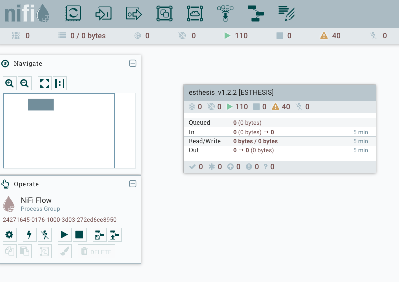
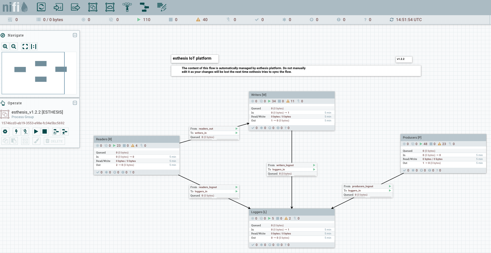

= esthesis IoT - Developers Guide
Doc Writer <esthesis@eurodyn.com>
:toc:
:toclevels: 2
:homepage: https://esthesis.com
:icons: font
:sectanchors:
:sectlinks:

The following sections provide information for software developers that might want to work with
_esthesis_ to extend its functionality.

=== Architecture
_esthesis_ is an IoT platform. Admittedly, this is a broad definition and may include, or not include,
different things according to the context in which it is being used. In high-level terms, in an IoT
environment you expect to have devices that collect data. You want to be able to communicate with
these devices, monitor them, update their local software, and collect data.

_esthesis_ takes a holistic approach towards devices and data management by utilising state of the
art, mature tools and building the necessary IoT management functionality on top.

The main architectural components of _esthesis_ consist of the following building blocks:

* A front-end, web-based application to manage the platform.
* A back-end application, to provide services necessary to the front-end as well as to devices.
* A device agent, to provide connectivity to remote devices.
* An MQTT server to communicate with devices.
* An Apache NiFi server to provide dataflow management services.

The following figure presents the main building blocks of _esthesis_ as well as the interconnection
between them:

.Architectural building blocks of _esthesis_
image::media/architecture2.png[]

The following sections provide an overview of the role of each building block into _esthesis_ IoT platform.

==== Front-end and Back-end
The _esthesis_ front-end and back-end are the core building blocks delivering the functionality of
_esthesis_ IoT platform.

The front-end component, provides the user interface of _esthesis_ platform. It is a modern,
Angular Single Page Application, compatible with all major Internet browsers.

The back-end block, provides the services necessary to fetch information to the front-end block as
well as services geared towards devices. It is made as a Spring Boot application.

==== Device agent
The device agent is the piece of software running within your device, allowing it to be remotely
managed. _esthesis_ comes with its own device agent that can be incorporated into your devices,
making them remotely managed with minimal effort.

The device agent is an autonomous piece of software, not being aware of what kind of device it is
running on. Effectively, the device agent does not know what
kind of sensors your device has, what kind of data needs to be collected, or how access to your sensors
is taking place. Communication with device-specific sensors and data collection
is handled by other custom, device-specific software running on the device. Such software
can be a complex, elaborated solution you have created as part of your project,
or it can be a simple cron-based script polling your sensors.

Data from sensors that has been collected locally can be easily transfered to _esthesis_ platfor
and from there anywhere else you have configured so. The _esthesis_ device agent provides two
local communication channels within your device: An embedded MQTT server, and an embedded
Web server. The configuration options of the device agent allows you to specify which of
those two channels become available, and you can choose to have none, either, or both active.

The local endpoints provided by the device agent allow any local process to submit data simply by
using a `localhost` address. Your data collection scripts, or software, does not need to be aware
of _esthesis_. As soon as data is received on any device agent's endpoints, it is automatically
transmitted to _esthesis_.

==== MQTT server
The MQTT server is the building block providing bidirectional communication between devices and the
_esthesis_ platform. _esthesis_ comes with an Eclipse Mosquitto MQTT, however you can use any other
compatible MQTT server. The MQTT design in _esthesis_ utilises five different topics to communicate
with devices as presented next:

.MQTT topics used with devices
The default topic names are depicted below, however topic names are configurable. If you wish to
change the topic names you need to do so in the configuration parameters of the device agent as
well as in the Data Reader data sinks of _esthesis_. The supported channels are:

* `esthesis/ping/{hardwareId}`: Heartbeat messages from devices. The frequency of each ping message,
when using the provided _esthesis_ device agent, is configurable. Direction: Device to _esthesis_ platform.
* `esthesis/telemetry/{hardwareId}`: Telemetry data submitted by the device. Direction: Device to _esthesis_ platform.
* `esthesis/metadata/{hardwareId}`: Metadata data submitted by the device. Direction: Device to _esthesis_ platform.
* `esthesis/control/reply/{hardwareId}`: Device response to a command previously received. Direction: Device to _esthesis_ platform.
* `esthesis/control/request/{hardwareId}`: Requests originating from _esthesis_ platform for the
device to execute a specific command. Direction: _esthesis_ platform to device.

For the exact format of each message payload, see <<dev-messaging-specs>>.

==== NiFi server
Apache Nifi is at the core of _esthesis_ platform design. It is the layer where data
delivery and distribution takes place, and it is fully managed by the _esthesis_ platform server.

_ethesis_ can work with the NiFi Docker Container it ships with, or plug into a NiFi instance you
might already have running. Once _esthesis_ plugs into a NiFi instance, it first deploys an
empty data workflow into NiFi, as depicted below:

._esthesis_ top-level NiFi Process Group


_esthesis_ creates a Process Group in the root of the NiFi instance and everything else in encapsulated
within that group, so it can co-exist with other already deployed processes in the same NiFi instance.
As NiFi is fully managed by the _esthesis_ platform, an _esthesis_ administrator is not expected to
interact directly with NiFi. Doing so may invalidate your installation.

Integration with NiFi is based on four different concepts as presented next:



===== Readers
Readers are responsible for inbound data traffic. Readers allow _esthesis_ to retrieve data
from a variety of data sources.
You can start with a single instance, for example, an MQTT Data Reader to ingest data from your devices
and expand to any number of additional Data Readers as your devices fleet starts to grow. Data Readers
can be of heterogeneous nature and you can intermix different types of technologies together,
as long as messages adhere to _esthesis_ messaging data protocol
(for protocol specifications, see <<dev-messaging-specs>>).

===== Writers
Writers are responsible for outbound data traffic. Writers allows _esthesis_ to persist data to
multiple different data targets at once, for example, storing your telemetry values in a time-series
database for long-term storage while in parallel you send them to a Kafka cluster for real-time processing.

===== Producers
Producers are responsible to generate data replies by querying their underlying data sources.
Producers allow _esthesis_ to provide REST-enabled endpoints that can be queried from external
components. Effectively, Producers are a gateway to the data that has been collected by _esthesis_.
You can have multiple Producers which are transparently load-balanced by _esthesis_.

===== Loggers
Loggers are responsible to concentrate logging output from all processors deployed in NiFi.

=== Device agent [[dev-device-agent]]
(tbc)

==== Hardware IDs
_How to work with, how to find them (TBC)_

==== Registration sequence
(tbc)

==== Provisioning sequence
(tbc)

==== Device data simulator [[dev-device-simulator]]
The device agent incorporates a data simulator allowing to quickly test your installation
or to simulate workloads to stress test your environment.

To enable the data simulator you can utilise the following configuration parameters:
`demo`, `demoFreqMsec`, `demoInitialDelayMsec`, `demoPayload` (see <<demo-parameters>>).

The default payload of the randomly generated data consists of the following JSON structure:
```
{
  "m": "demo",
  "v": {
     "temperature": %i%,
     "humidity": %f%
  }
}
```

The `%` placeholders denote variables that will be substituted during message construction. In particular:

* `%i%` will be substituted with a random integer value from 0 to 100.
* `%f%` will be substituted with a random float value from 0 to 100.

=== Telemetry vs Metadata
_esthesis_ supports two different types of payload-carrying messages, Telemetry messages and Metadata.
The format of both messages is identical and follows the specifications of <<dev-messaging-specs>>,
however _esthesis_ treats them differently once received.

Telemetry payloads, are treated as data with important historical value, therefore each new data
submission is added alongside any previous data submissions. Telemetry data are therefore kept in
an incremental fashion and older submissions are never replaced. For example, the temperature value
of a CPU sent as a telemetry payload, can be stored in an underlying time-series database, so that
the full history of the CPU temperature can be obtained at any time.

Metadata payloads on the other hand, are treated as data having a value which is only relevant by
its latest submission. Therefore, metadata payloads always replace any previous submissions and
there is only a single value (i.e. the latest one submitted) available. For example, the
IP address of a device can be a metadata payload, as it changes infrequently and in the vast
majority of cases we are only interested about the currently allocated IP address.

=== _esthesis_ messaging specifications [[dev-messaging-specs]]
_esthesis_ supports a simple, lightweight, JSON-based message payload.

The JSON payload consists of a key describing what kind of information the message contains,
followed by another key with one or more specific measurements. The nature of the message, whether it is
telemetry or metadata, is not part of the message content itself as this is denoted by the
channel/topic on which the message was posted into.

==== Telemetry and Metadata messagesFor example:

.Single anonymous value
```
{
  "m": "temperature",
  "v": 12.3
}
```
This payload will create a measurement `temperature` with a variable name `value` having a value of `12.3`.

.Single named value
```
{
  "m": "climate",
  "v": {
    "temperature": 4,
  }
}
```
This payload will create a measurement `climate` with a variable named `temperature` having a value of `4`.

.Multiple named values
```
{
  "m": "climate",
  "v": {
    "temperature": 9.5,
    "humidity": 47
  }
}
```
This payload will create a measurement `climate` with two variables, a variable named `temperature`
having a value of `9.5`, and a variable named `humidity` having a value of `47`.

===== PING message example
```
{
  "m": "ping",
  "v": 1607015126194
}
```
This is the standard format of the PING message type payload. The value is expressed as EPOCH in
milliseconds. This message is sent periodically from the device to _esthesis_ service as a heartbeat.

===== TELEMETRY message example
```
{
  "m":"health",
  "v":{
    "cpuTemperature": 61.875,
    "memoryAvailable": 6148300800,
    "load1": 3.8447265625,
    "load5": 3.625,
    "load15": 3.38671875,
    "mount_free_/": 161166557184
  }
}
```

===== METADATA message example
```
{
  "m": "health",
  "v": {
     "currentTime":1607015126909,
     "upTime":10284,
     "ipAddress":"bridge0: 192.168.100.100",
     "runtimeVersion":"2.0.0",
  }
}
```

=== Development environment
.Main technical stack
* JDK 15.x
* Maven 3.8.x
* Spring Boot 2.x
* Angular 13

.Version control
https://github.com/esthesisiot

Integration of new features takes place via GitHub's Pull Requests.

.Booting up a development support infrastructure
The Docker Compose file used for setting up _esthesis_ in a production environment, can also be
used to setup a development environment. However, a few changes apply in that case:

- You do not need all the services described in Docker Compose, as you will be running the _esthesis_
front-end and back-end in your local machine in debug mode.
- You need direct access to the underlying service containers, so additional ports need to be mapped.
- You need additional tools to help you debug the services.

All the above is already prepared using an additional Docker Compose file targetted for developers,
`docker-compose-devenv.yml`. You can therefore leverage Docker Compose's capability to utilise
multiple files and setup all necessary support services for your development environment as:
```
docker compose -f docker-compose.yml -f docker-compose-devenv.yml up -d \
    esthesis-db esthesis-mqtt esthesis-tsdb esthesis-nifi esthesis-chronograf
```

The above command will prepare Docker containers for the following services:

- A `MySQL database`, accessible on `port 3306` as `esthesis/esthesis`.
- An `MQTT server`, accessible on `ports 1883/8883`. Port 1883 allows you to connect without certificates.
- An `InfluxDB`, accessible on `port 8086` as `admin/admin`.
- An `Apache NiFi`, accessible on `port 8080`.
- A `Chronograf` client, accessible on `port 8888`.

.Starting _esthesis_ front-end in development mode
To start the _esthesis_ Angular front-end application in your development machine, you can execute:
```
npm start
```
The application will be available on:
```
http://localhost:4200
```

.Starting _esthesis_ back-end in development mode
To start the _esthesis_ Spring Boot back-end application in your development machine, you can execute:
```
mvn spring-boot:run \
    -Xdebug -XX:+ShowCodeDetailsInExceptionMessages \
    -Xrunjdwp:transport=dt_socket,server=y,suspend=n,address=55000" \
    -Dspring-boot.run.arguments="--server.port=46000
```
The REST api of the application will be available on `port 46000`, and you can connect your debugger
on `port 55000`.

.Starting and registering a device
You can start a local device executing the following command:
```
hardwareId=device1 \
storageRoot="$(echo ~$USER)/.esthesis/devices/device1" \
registrationUrl="http://localhost:46000" \
tags=group1 \
jenv exec mvn spring-boot:run -Dspring-boot.run
```

=== Publishing releases
==== Docker
Publishing Docker images can be done using the provided Docker Compose file. You can execute:

._esthesis_ platform
```
pushd . && \
cd esthesis-setup/docker && \
docker compose build && docker compose push && \
popd
```

._esthesis_ device agent
```
pushd . && \
cd esthesis-device && \

```


==== Helm
To publish _esthesis_ Helm charts you need to execute the following sequence:

```
pushd . && \
cd esthesis-setup/k8s/helm && \
helm package esthesis-platform -d ../../../esthesis-docs/helm && \
cd ../../../esthesis-docs/helm && \
helm repo index . && \
popd
```

IMPORTANT: Before you publish a Helm chart, ensure that the version of the Helm chart in `Chart.yaml` has been
updated.

To make the updated Helm chart available, you need to push the the `esthesis-docs` repository.
