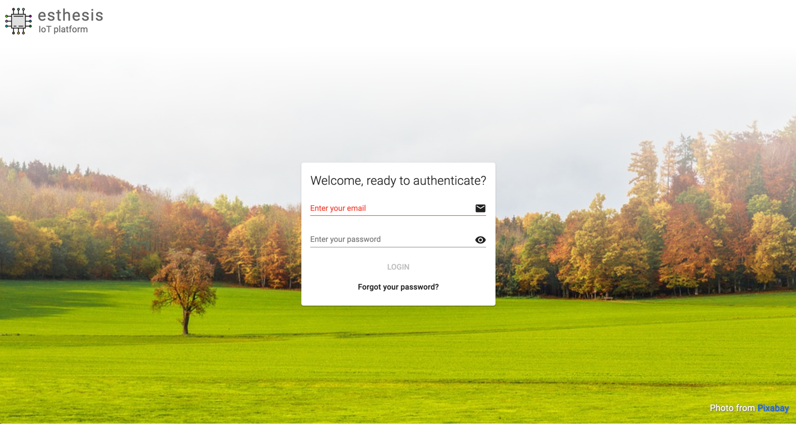
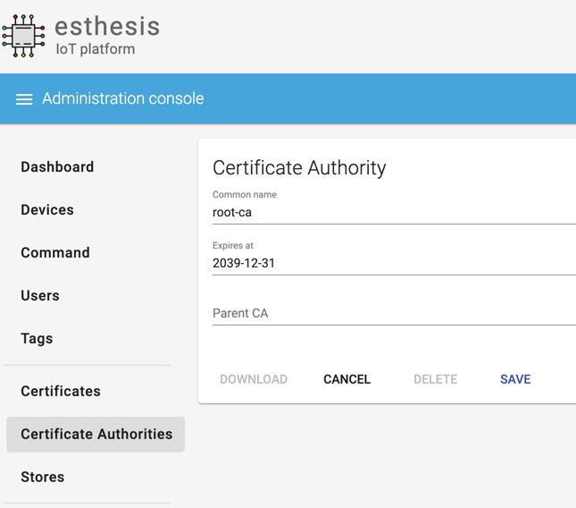
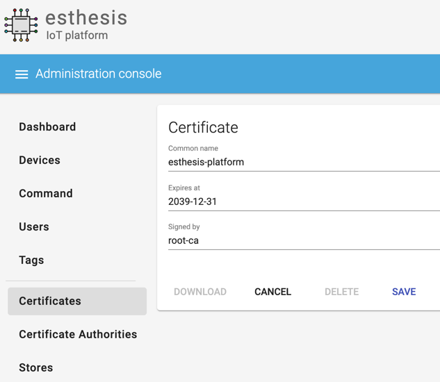
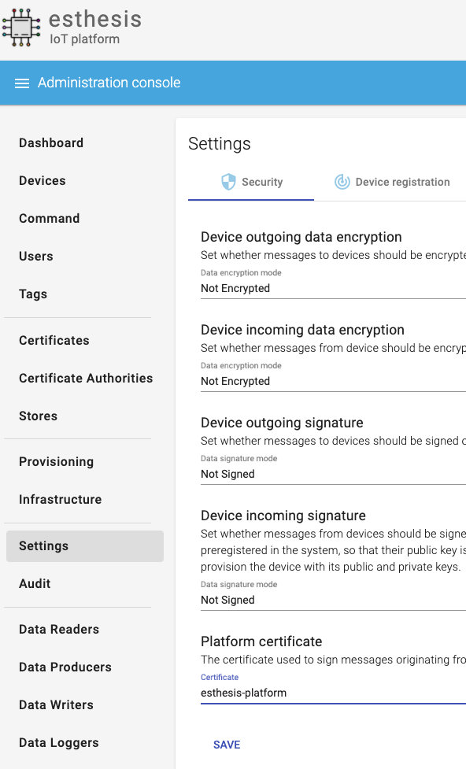
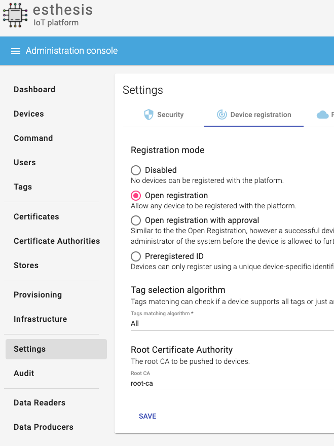
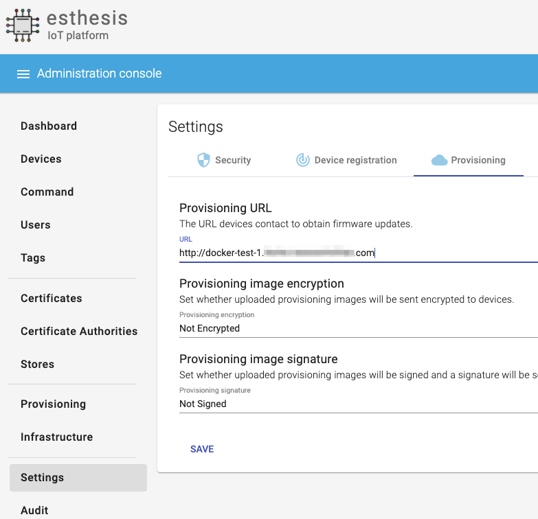
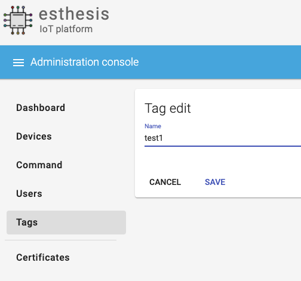
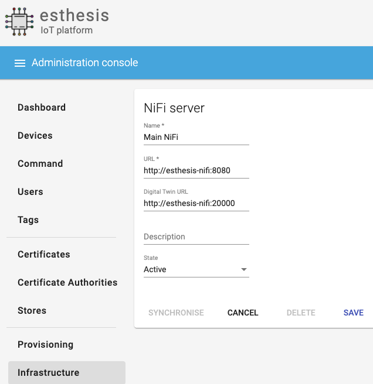
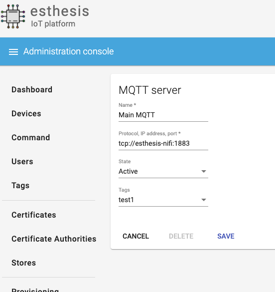

= esthesis IoT platform
Doc Writer <esthesis@eurodyn.com>
:toc:
:toclevels: 2
:homepage: https://esthesis.com
:icons: font
:sectanchors:
:sectlinks:

_esthesis_ is a modern Internet of Things platform, providing end-to-end management services
for your devices. It consists of device management functionality, over-the-air firmware upgrade
services, and a modular data-management approach. Built-in support for certificates and certificate
authorities allows you to effortlessly set up a secure communication environment with your devices where
provisioning packages can be signed and/or encrypted on the fly.

== Installation
Installation is based on public Docker containers, so you can setup your own _esthesis_ environment
quickly and with minimal effort. A Docker Compose file is provided so that you can setup all the
necessary infrastructure from scratch:

.Support services
* **A MySQL database**, acting as the main database of the platform. It stores information about the
devices, users, provisioning packages, etc., but not any device telemetry data.
* **An Apache NiFi instance**, acting as the data management and data distribution layer.
* **An Eclipse Mosquitto MQTT server**, providing the necessary infrastructure for device communication.
* **An InfluxDB database**, to store device telemetry data.
* **An NGINX reverse proxy**, to expose _esthesis_ services.

.Main services
* **esthesis platform backend server**, the server component of the platform.
* **esthesis platform frontend**, a web-based frontend for users to manage the platform.

While 'main services' are necessary for _esthesis_ to function, everything provided by the 'support services'
is optional, so you can replace it with your own locally managed installations. In the following sections
you can find examples of both approaches.

TIP: Depending on your bandwidth and Docker Engine's host performance, it might take a few minutes
for the platform to be up and running. In a typical environment, the platform should be accessible
within 2-3 minutes.

=== Installation options

==== All-in-one installation
This installation is the quickest way to go from an empty system to a fully-functional _esthesis_
platform in just a few minutes. It will create, link and configure all necessary Docker
containers to provide all the support and main services for you.

You can perform an all-in-one installation issuing the following command:

```
curl -Ls https://cutt.ly/esthesis | \
DB_PORT=45000 \
MYSQL_ROOT_PASSWORD=root \
MYSQL_USER=esthesis \
MYSQL_PASSWORD=esthesis \
MYSQL_DATABASE=esthesis \
PORT_MQTT=1883 \
PORT_MQTT_SECURE=8883 \
INFLUXDB_DB=esthesis \
INFLUXDB_ADMIN_USER=admin \
INFLUXDB_ADMIN_PASSWORD=admin \
NIFI_WEB_PROVIDERS_PORT_LOW=20000 \
NIFI_WEB_PROVIDERS_PORT_HIGH=20100 \
NIFI_WEB_UI=8080 \
PORT_ESTHESIS_BACKEND=46000 \
PORT_ESTHESIS_UI=8080 \
PORT_ESTHESIS_PROXY=80 \
docker-compose -p esthesis -f /dev/stdin up -d
```

The above command will fetch _esthesis_' https://raw.githubusercontent.com/esthesis-iot/esthesis-setup/master/docker/prod/docker-compose.yml[docker-compose file]
and setup all necessary containers with the configuration options you have specified above.

==== Selective services only installation
You can specify which specific services of _esthesis_ you need in your installation by takign advantage
of Docker Compose's built-in functionality to only start specific services. For example, if you want
to use your own resources instead of _esthesis_ 'supporting services' and only install _esthesis_
'main services', you can substitute `docker-compose -p esthesis -f /dev/stdin up -d` above with:

```
docker-compose -p esthesis -f /dev/stdin up -d esthesis-platform-backend-server esthesis-platform-ui
```

==== Manual installation
You can download the configuration options and the docker-compose file to change them in order to
perform a custom, manual installation:
https://raw.githubusercontent.com/esthesis-iot/esthesis-setup/master/docker/prod/docker-compose.yml[docker-compose file],
https://raw.githubusercontent.com/esthesis-iot/esthesis-setup/master/docker/prod/.env[.env file].
Once you have the files locally downloaded, you can proceed to the installation issuing the following command:
```
docker-compose -p esthesis up -d
```

=== Post-installation steps
==== Check containers status
As soon as all Docker containers have been initialised you can start using _esthesis_. You can monitor the status of your deployment using:

```
docker ps --format 'table {{.Names}}\t{{.Status}}' | grep esthesis
```

Once all containers are reportes as `healthy` you can login to _exthesis_.

==== Web location and admin account
Using the default configuration options of _esthesis_, the frontend application is available on
port 8080 of your Docker Engine host. For example, http://my-esthesis-host:8080.

The default administration credentials are:
```
Username: admin@esthes.is
Password: admin
```

WARNING: You should change the default credentials as soon as possible to prevent unauthorised access to your platform.

== Quick start

This section will guide you through some basic configuration options once you have a new installation
of _esthesis_ up and running. Please take into account that the configuration options presented here are
probably not what you should be using in production, so you may need to tweak them to your
organisation's requirements before you expose _esthesis_ services to untrusted networks.

=== Create a certificate authority

* Navigate to `Certificate Authorities`.
* Create a new certificate authority, leaving the `Parent CA` option empty.

=== Create a platform certificate

* Navigate to `Certificates`.
* Create a new certificate choosing the certificate authority created above as `Signed by`.

=== Platform settings - security

* Navigate to `Settings` > `Security`.
* Set the Platform certificate to the certificate you created above.

=== Platform settings - Device registration

* Navigate to `Settings` > `Device registration`.
* Set Registration mode to `Open registration`.
* Set Root Certificate Authority to the one you created above.

=== Platform settings - Provisioning

* Navigate to `Settings` > `Provisioning`.
* Set Provisioning URL to the address where _esthesis_ platform proxy container is accessible from.

=== Create a tag

* Navigate to `Tags`.
* Create a tag you can associate resources with.

=== Register and synchronise NiFi

* Navigate to `Infrastructure` > `NiFi`.
* Register the NiFi server to be used by _esthesis_.
* Once NiFi is registered, open on the newly created instance and click on `Synchronise`. Synchronisation
will take a few seconds; you can monitor the progress bar on top of your screen. Once synchronisation
is completed, you will be automatically redirected back to the list of NiFi servers.

=== Register the MQTT server

* Navigate to `Infrastructure` > `MQTT`.
* Register the MQTT server to be used by _esthesis_, associating it with the tag you created before.

=== Setup Data sinks
For the purpose of a quick setup, the Data Wizards functionality will be used.
* Navigate to `Data Wizards`.

=== Register a demo device
You can now, optionally, register a demo device before you start using your real devices. _esthesis_
<<_device_agent>> is provided as a Docker container (on top of a standalone agent format), so you can use it to quickly fire up a virtual demo device.

== User guide
TBC

== Device agent
The device agent is the piece of software that runs in your devices allowing you to seamlessly connect
and control them from _esthesis_ platform. _esthesis_ provides a device agent that you can use
right of the box to interconnect any device capable of running Java (future versions of the device
agent will support additional options).

This section presents the functionality as well as the configuration options of the device agent.

=== Configuration
The device agent comes with a plethora of configuration options to accommodate different hardware and
deployments as presented next. Mandatory parameters for the device agent to bootup properly are denoted with [red]#*#. Values in **bold** indicate default values.

.Commonly used parameters
[cols="1,^,1"]
|===
|Parameter |Value |Description

|hardwareId [red]#*#
|Alphanumeric
|An ID that uniquely identifies this device. See also <<_hardware_ids>>.

|pauseStartup
|true, **false**
|A flag indicating whether the device should start paused. A paused device requires a keyboard input
to resume booting, useful when debugging devices.

|provisioningForkType
|**soft**, hard
|A provisioning package contains a script that will be executed by the agent in order to
 initiate the actual provisioning process. This flag defines how such execution will take place:

 soft: The script is called as a child process, controlled by the runtime agent. As soon as the
       agent terminates, the provisioning script terminates too.

 hard: The script is called as an independent process, not controlled by the runtime agent.

|provisioningPostHook
|
|The script to be called after a provisioning package is downloaded.
The script is handed the following parameters:

1. The full pathname to the provisioning package.

2. Whether this is an initial provisioning or not (as a true/false value).

|provisioningRoot
|If empty, $storageRoot/provisioning
|The root folder to store remotely retrieved provisioning packages.

|provisioningTempRoot
|If empty, $storageRoot/provisioning/.tmp
|The root folder to temporarily download a remotely retrieved provisioning packages. Once the
 package is downloaded, it is moved to provisioningRoot.

|rebootCommand
|
|The command to be executed to reboot the device.

|registrationUrl
|
|The URL of the esthesis platform with which the device will attempt to register with. For example,
'http://my-esthesis-installation.com'.

|secureStorageRoot
|If empty, $storageRoot
|The root folder under which secure persistent storage is provided.

|storageRoot [red]#*#
|
|The folder to store the agent's configuration and runtime files. For example, '/storage/esthesis'.

|tags
|
|A comma-separated list of tags for the device to present during registration.

|topicPing
|**esthesis/ping**
|The MQTT topic to send PING messages.

|topicTelemetry
|**esthesis/telemetry**
|The MQTT topic to send TELEMETRY messages.

|topicMetadata
|**esthesis/metadata**
|The MQTT topic to send METADATA messages.

|topicControlRequest
|**esthesis/control/request**
|The MQTT topic to listen for CONTROL REQUEST messages.

|topicControlReply
|**esthesis/control/reply**
|The MQTT topic to send CONTROL REPLY messages.

|skipInitialProvisioning
|**true**
| A flag for the device to skip initial provisioning, useful in case the device comes with a firmware image already installed during factory setup.

|skipRegistration
|**false**
|A flag indicating to skip the initial device registration with _esthesis_ platform, useful if you ship
devices already registered.

|supportedCommands
|**PROVISIONING_CHECK_NEW,
PING,
HEALTH,
REBOOT,
EXECUTE**
|A comma-separated list of commands this device supports.
|===

.Communication parameters
[cols="1,^,1"]
|===
|Parameter |Value |Description

|requestAttempts
|**100**
|The maximum number a request (to esthesis platform) is retried.

|requestMaxBackoff
|**60**
|The maximum number of minutes to wait between attempts of previously failed requests.

|requestRetryBackoff
|**1000**
|Number of milliseconds to wait before trying again a previously failed request.

|===

.Local services
[cols="1,^,1"]
|===
|Parameter |Value |Description

|proxyMqtt
|true, **false**
|A flag to indicate that the embedded MQTT-to-MQTT proxy server should be started.

|proxyMqttPort
|**4566**
|The port of the embedded proxy MQTT server.

|proxyWeb
|true, **false**
|A flag to indicate that the embedded web-to-MQTT proxy server should be started.

|proxyWebPort
|**4567**
|The port of the embedded proxy Web server.

|===

.Security parameters
[cols="1,^,1"]
|===
|Parameter |Value |Description

|asymmetricCipher
|**RSA/ECB/PKCS1Padding**
|The cipher used for asymmetric encryption/decryption

|asymmetricKeyAlgorithm
|**RSA**
|The algorithm the asymmetric keys (i.e. public and private keys) are created with.

|Whether incoming messages should be encrypted.
|true, **false**
|A flag indicating whether incoming messages should be encrypted.

|incomingSigned
|true, **false**
|A flag indicating whether incoming messages should be signed.

|outgoingEncrypted
|true, **false**
|A falg indicating whether outgoing messages are encrypted.

|outgoingSigned
|true, **false**
|A flag indicating whether outgoing messages are signed.

|provisioningEncrypted
|true, **false**
|A flag indicating whether incoming provisioning packages should be encrypted.

|provisioningSigned
|true, **false**
|A flag indicating whether incoming provisioning packages should be signed.

|signatureAlgorithm
|**SHA256withRSA**
|The algorithm to be used when signing messages.

|symmetricCipher
|**AES/CBC/PKCS5Padding**
|The cipher used for symmetric encryption/decryption.

|symmetricKeyAlgorithm
|AES
|The algorithm the symmetric key (i.e. the session key) is created with.

|===

.Health checks parameters
[cols="1,^,1"]
|===
|Parameter |Value |Description

|healthDataFreqMsec
|**3600000**
|How often health data from the node are transmitted back to the platform (in msec).

|healthDataInitialDelayMsec
|**3600000**
|How long to wait before starting transmitting health data (in msec).

|pingFreqMsec
|60000
|How often PING data is sent (in msec).

|pingInitialDelayMsec
|60000
|How long to wait before start sending ping data (in msec).

|hcOsManufacturer
|**true**, false
|Return manufacturer information in health messages.

|hcOsVersion
|**true**, false
|Return OS version information in health messages.

|hcHwSerial
|**true**, false
|Return hardware serial number information in health messages.

|hcCpuPhysicalPackage
|**true**, false
|Return the number of CPUs information in health messages.

|hcCpuPhysicalCores
|**true**, false
|Return the number of physical CPU cores information in health messages.

|hcCpuLogicalCores
|**true**, false
|Return the number of logical CPU cores information in health messages.

|hcCpuIdentifier
|**true**, false
|Return the CPU identifier information in health messages.

|hcCpuProcessorId
|**true**, false
|Return the CPU processor ID information in health messages

|hcCpuTemperature
|**true**, false
|Return the CPU temperature information in health messages.

|hcMemoryAvailable
|**true**, false
|Return the available memory information in health messages.

|hcMemoryTotal
|**true**, false
|Return the total memory information in health messages.

|hcLoad1
|**true**, false
|Return the load in the last 1' information in health messages.

|hcLoad5
|**true**, false
|Return the load in the last 5' information in health messages.

|hcLoad15
|**true**, false
|Return the load in the last 15' information in health messages.

|hcFs
|**true**, false
|Return information about filesystems usage in health messages.

|hcFilterFs
|
|A comma-separated list of filestystems to include in health messages. If left empty, all
discovered filesystems will be included.

|hcCurrentTime
|**true**, false
|Return the device's local clock date/time.

|hcUpTime
|**true**, false
|Returns the device's uptime in health messages.

|hcIpAddress
|**true**, false
|Returns the device's IP address in health messages.

|hcIpIfFilter
|
|A comma-separated list of interface names to include when reporting their IP address. If left
empty, all interfaces will be included.

|runtimeVersion
|**true**, false
|Returns the device's agent version in health messages.

|runtimeCommitId
|**true**, false
|Returns the commit ID of the runtime agent running on the device in health messages.

|firmwareVersionFile
|
|A file containing the firmware version to be reported. The contents of this file are read by the
agent and reported in health checks.
|===

=== Installation
The device agent comes in the form of a self-contained Java JAR file. The JAR file encapsulates all
the runtime dependencies needed, so you can execute the agent just by obtaining the
`esthesis-platform-device.jar` file. To ease integration and, in particular, updates of the device
agent, the JAR filename does not contain a version information. However, detailed version information
is available within the JAR file (see Developer guide, <<dev-device-agent>>).

The device agent can be executed in your device using a command similar to:
```
hardwareId=device1 \
storageRoot="$(echo ~$USER)/.esthesis" \
registrationUrl=http://my-esthesis-installation \
java -jar target/esthesis-platform-device.jar
```

_esthesis_ comes with a Device Simulator to let you test your installation. To use the Device simulator, see <<dev-device-simulator>>.

=== Embedded Web server
TBC

=== Embedded MQTT server
TBC

== Developer guide
The following sections provide information for software developers that might want to work with
_esthesis_ to extend its functionality.

.Main technical stack
* JDK 13.x
* Maven 3.6.x
* Spring Boot 2.x
* Angular 9

=== Data Sinks [[dev-data-sinks]]
TBC

=== Device agent [[dev-device-agent]]
TBC

==== Device simulator [[dev-device-simulator]]
A device simulator running the device agent is provided by _esthesis_ as a Docker container. You can
use the device simulator to test your installation or to simulate workloads to stress test your
environment.

==== Hardware IDs
