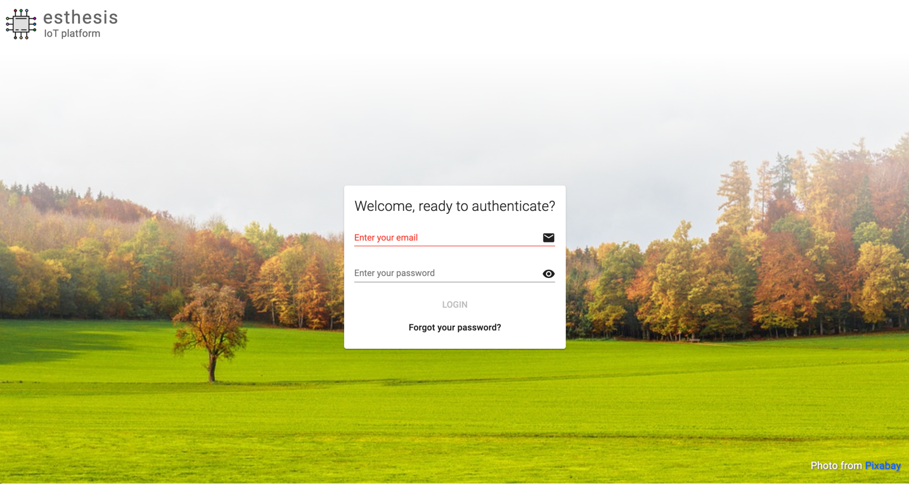
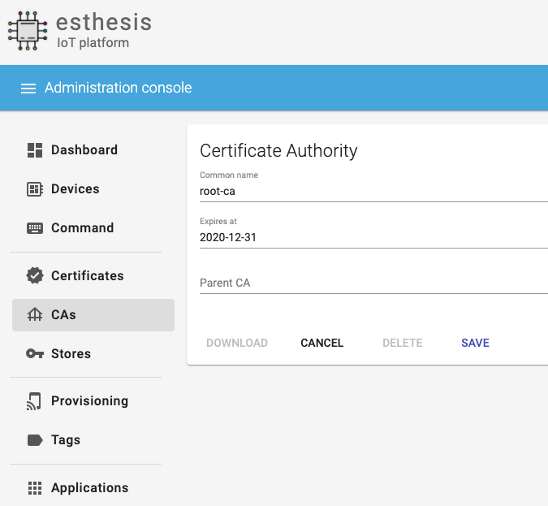
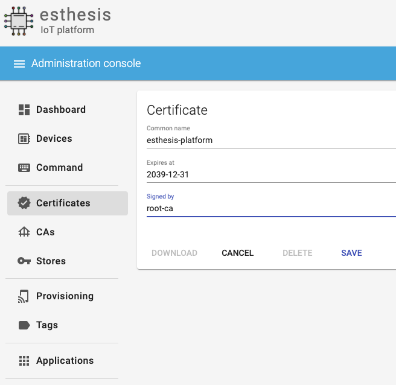
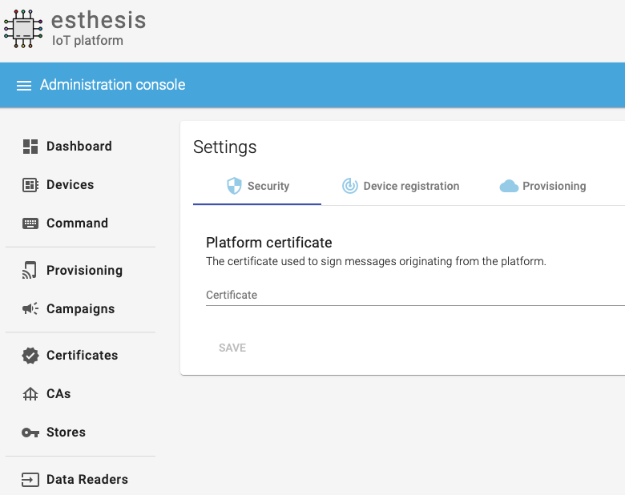
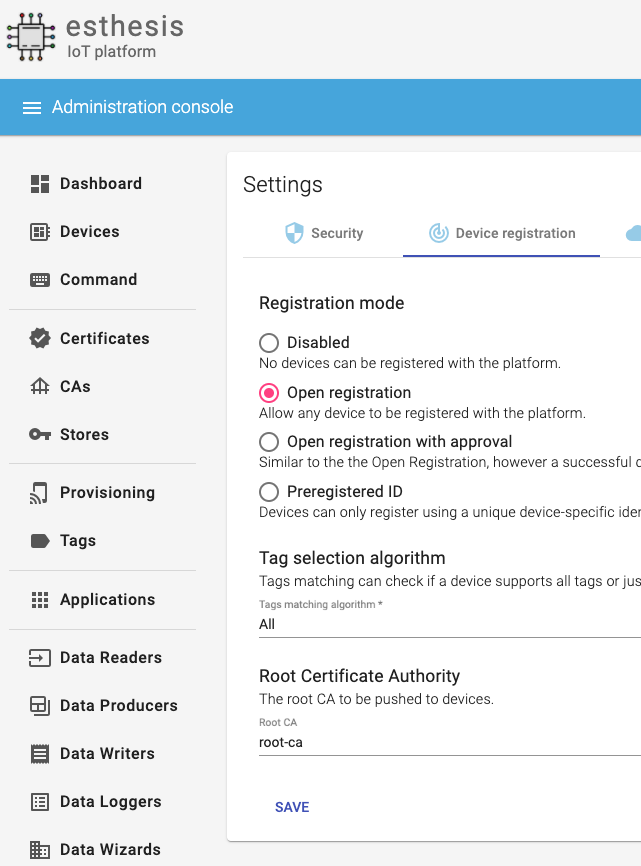
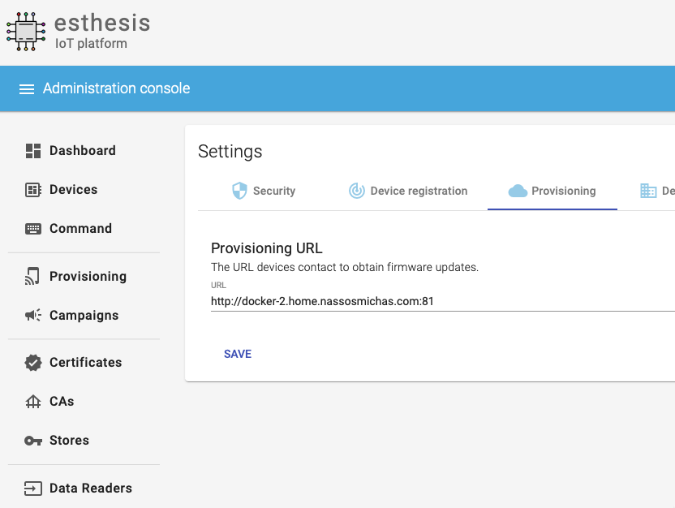
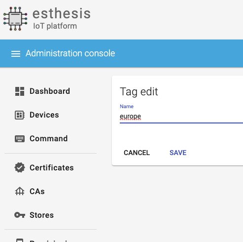
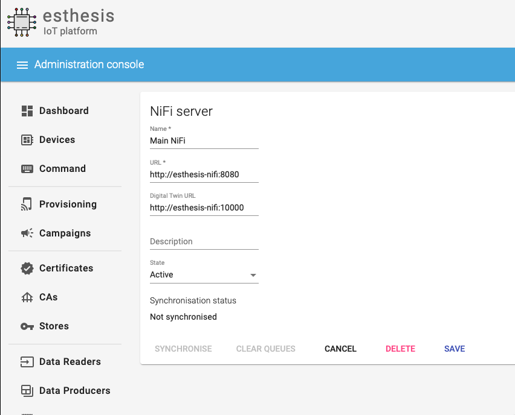

= esthesis IoT - Installation Guide
Doc Writer <esthesis@eurodyn.com>
:toc:
:toclevels: 2
:homepage: https://esthesis.com
:icons: font
:sectanchors:
:sectlinks:

_esthesis_ is a modern Internet of Things platform, providing end-to-end management services
for your devices. It consists of device management functionality, over-the-air firmware upgrade
services, and a modular data-management approach.

== Installation
Installation is based on public Docker containers, so you can setup your own _esthesis_ environment
quickly and with minimal effort. You can install _esthesis_ in a Docker Engine, in a Kubernetes cluster,
or in an OCP cluster.

_esthesis_ requires a variety of third-party support services to be available to operate properly. These
services can be deployed as part of _esthesis_' own deployment or you can opt to skip them to provide
your own instances instead. For example, _esthesis_ requires an InfluxDB to store time-series data and will
setup one as part of the default installation process. However, in case you already have a running
InfluxDB, you can skip the default installation of InfluxDB and point _esthesis_ to use the one you
already have in place.

.Main services
The main services of _esthesis_ platform consist of:

* **esthesis platform backend server**, the server component of the platform.
* **esthesis platform frontend**, a web-based frontend for users to manage the platform.

.Supporting services
The list of supporting services required by _esthesis_ include:

* **A MySQL database**, acting as the main database of the platform. It stores information about the
devices, users, provisioning packages, etc. This database does not store any device telemetry data.
* **An Apache NiFi instance**, acting as the data orchestration layer.
* **An Eclipse Mosquitto MQTT server**, providing the necessary infrastructure for device communication.
* **An InfluxDB database**, to store device telemetry data.
* **An NGINX reverse proxy**, to expose _esthesis_ services without providing direct access to the
_esthesis_ backend server.

=== Installation options

==== Docker
===== All-in-one installation
This installation is the quickest way to go from an empty system to a fully-functional _esthesis_
platform in just a few minutes. It will create, link and configure all necessary Docker
containers to provide all the support and main services for you.

You can perform an all-in-one installation issuing the following command:

```
curl -Ls https://raw.githubusercontent.com/esthesisiot/esthesis-setup/master/docker/docker-compose.yml |
docker compose -f /dev/stdin up -d --no-build
```

===== Selective services only installation
You can specify which services of _esthesis_ you need in your installation by taking advantage
of Docker Compose's built-in functionality to only start specific services. For example, if you want
to use your own resources instead of _esthesis_ 'supporting services' and only install _esthesis_
main services, you can substitute `docker compose -f /dev/stdin up -d` above with:

```
docker compose -f /dev/stdin up -d esthesis-server esthesis-ui
```

==== Kubernetes
TBC

==== OCP
TBC

== Quick start

This section will guide you through some basic configuration options once you have a new installation
of _esthesis_ up and running. Please take into account that the configuration options presented here
are default options to get you up and running as soon as possible; you may need to tweak them to
your organisation's requirements before you expose _esthesis_ services to untrusted networks.

The default administration credentials are:
```
Username: admin@esthes.is
Password: admin
```

WARNING: You should change the default credentials as soon as possible to prevent unauthorised access to your platform.

=== Create a certificate authority

* Navigate to `Certificate Authorities`.
* Create a new certificate authority, leaving the `Parent CA` option empty.

=== Create a platform certificate

* Navigate to `Certificates`.
* Create a new certificate choosing the certificate authority created above as `Signed by`.

=== Platform settings - Security

* Navigate to `Settings` > `Security`.
* Set the Platform certificate to the certificate you created above.

=== Platform settings - Device registration

* Navigate to `Settings` > `Device registration`.
* Set Registration mode to `Open registration`.
* Set Root Certificate Authority to the one you created above.

=== Platform settings - Provisioning

* Navigate to `Settings` > `Provisioning`.
* Set Provisioning URL to the address where _esthesis_ platform proxy container is accessible from.

=== Create a tag

* Navigate to `Tags`.
* Create a tag you can associate resources with.

=== Register and synchronise NiFi

* Navigate to `Infrastructure` > `NiFi`.
* Register the NiFi server to be used by _esthesis_.
* Once NiFi is registered, open on the newly created instance and click on `Synchronise`. Synchronisation
will take a few seconds; you can monitor the progress bar on top of your screen. Once synchronisation
is completed, you will be automatically redirected back to the list of NiFi servers.

=== Register the MQTT server
image::images/image-2020-12-03-18-57-55-497.png[]
* Navigate to `Infrastructure` > `MQTT`.
* Register the MQTT server to be used by _esthesis_, associating it with the tag you created before.

=== Setup Data sinks
image::images/image-2020-12-03-18-59-41-472.png[]
For the purpose of a quick setup, the Data Wizards functionality will be used.

* Navigate to `Data Wizards`.
* Select `Standard infrastructure` and click on `Next`.
* Fill-in the standard infrastructure data wizard form. If you have installes _esthesis_ using the
provided Docker Compose file, you only need to change the address of your Docker engine and leave
the remaining values to their default values.
* Click on `Execute Wizard'. Once the progress bar is completed, your installation is fully configured.

=== Register a demo device
You can, optionally, register a demo device before you start using your real devices. _esthesis_
<<_device_agent>> is provided as a Docker container (on top of a standalone agent format), so you can use it to quickly fire up a virtual demo device. To start your demo device, issue a command similar
to:
```
docker run --name esthesis-demo-device --network=esthesis_esthesis-prod -d  \
-e hardwareId=device1 \
-e storageRoot="/app" \
-e tags=test1 \
-e registrationUrl="http://my-esthesis-host:port" \
esthesis/esthesis-platform-device:latest
```

The demo device can also send random data, if configured accordingly. For demo data configuration see
<<dev-device-simulator>>.

To enable debug output on your demo device, you can add the following parameter:
```
-e logging.level.esthesis=trace
```
