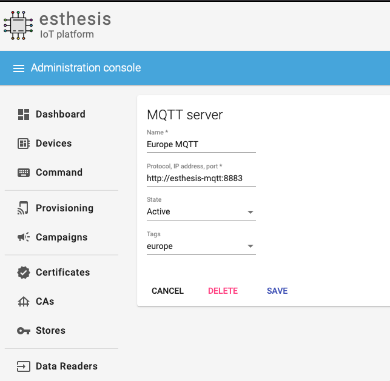
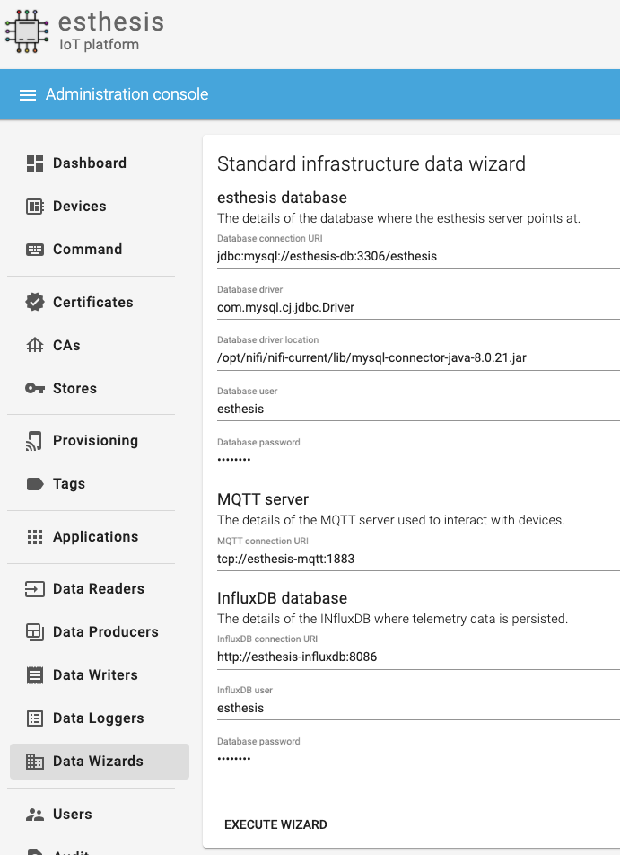
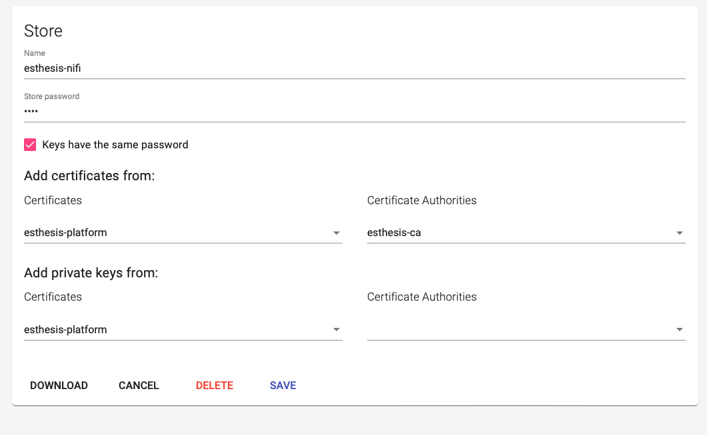

= esthesis IoT - Installation Guide
Doc Writer <esthesis@eurodyn.com>
:toc:
:toclevels: 2
:homepage: https://esthesis.com
:icons: font
:sectanchors:
:sectlinks:

_esthesis_ is a modern Internet of Things platform, providing end-to-end management services
for your devices. It consists of device management functionality, over-the-air firmware upgrade
services, and a modular data-management approach.

== Installation
Installation is based on public Docker containers, so you can setup your own _esthesis_ environment
quickly and with minimal effort. You can install _esthesis_ in a Docker Engine or in a Kubernetes
cluster.

_esthesis_ requires a variety of third-party support services to be available to operate properly. These
services can be deployed as part of _esthesis_' own deployment or you can opt to skip them to provide
your own instances instead. For example, _esthesis_ requires an InfluxDB to store time-series data and will
setup one as part of the default installation process. However, in case you already have a running
InfluxDB, you can skip the default installation of InfluxDB and point _esthesis_ to use the one you
already have in place.

.Main services
The main services of _esthesis_ platform consist of:

* **esthesis platform backend server**, the server component of the platform.
* **esthesis platform frontend**, a web-based frontend for users to manage the platform.

.Supporting services
The list of supporting services required by _esthesis_ include:

* **A MySQL database**, acting as the main database of the platform. It stores information about the
devices, users, provisioning packages, etc. This database does not store any device telemetry data.
* **An Apache NiFi instance**, acting as the data orchestration layer.
* **An Eclipse Mosquitto MQTT server**, providing the necessary infrastructure for device communication.
* **An InfluxDB database**, to store device telemetry data.
* **An NGINX reverse proxy**, to expose _esthesis_ services without providing direct access to the
_esthesis_ backend server.

=== Installation options

==== Docker
===== All-in-one installation
This installation is the quickest way to go from an empty system to a fully-functional _esthesis_
platform in just a few minutes. It will create, link and configure all necessary Docker
containers to provide all the support and main services for you.

You can perform an all-in-one installation issuing the following command:

```
curl -Ls https://raw.githubusercontent.com/esthesisiot/esthesis-setup/master/docker/docker-compose.yml |
docker compose -f /dev/stdin up -d --no-build
```

===== Selective services only installation
You can specify which services of _esthesis_ you need in your installation by taking advantage
of Docker Compose's built-in functionality to only start specific services. For example, if you want
to use your own resources instead of _esthesis_ 'supporting services' and only install _esthesis_
main services, you can substitute `docker compose -f /dev/stdin up -d` above with:

```
docker compose -f /dev/stdin up -d esthesis-server esthesis-ui
```

==== Kubernetes
_esthesis_ provides Helm charts, allowing you to quickly setup a production-grade installation.

The _esthesis_ Helm chart installs the following components in your Kubernetes cluster:

- The _esthesis_ User Interface.
- The _esthesis_ back-end server.
- An MQTT server based on Eclipse Mosquitto.
- A time series database based on InfluxDB.
- A relational database based on MySQL.
- The Apache NiFi platform.

_esthesis_ UI as well as _esthesis_ MQTT deployments, specify a service of type `LoadBalancer`.

===== Installation
To install _esthesis_ using Helm, you can issue the following sequence:
```
helm repo add esthesisiot https://esthes.is/helm
help repo update
helm install esthesisiot esthesisiot/esthesis-platform
```

===== Customising the Helm chart for your infrastructure

.Storage Class
To modify the storage class to suit your own infrastructure, you can issue the following command:
```
helm install esthesisiot esthesisiot --set global.storageClassName=my-storage-class
```


== Quick start
image::media/ig-img2.png[Login screen]
This section will guide you through some basic configuration options once you have a new installation
of _esthesis_ up and running. Please take into account that the configuration options presented here
are default options to get you up and running as soon as possible; you may need to tweak them to
your organisation's requirements before you expose _esthesis_ services to untrusted networks.

The default administration credentials are:
```
Username: admin@esthes.is
Password: admin
```

WARNING: You should change the default credentials as soon as possible to prevent unauthorised access to your platform.

=== Create a certificate authority
image::media/ig-img3.png[alt="Creating a certificate authority"]
* Navigate to `Certificate Authorities`.
* Create a new certificate authority, leaving the `Parent CA` option empty.

=== Create a platform certificate
image::media/ig-img4.png[alt="Creating a certificate"]
* Navigate to `Certificates`.
* Create a new certificate choosing the certificate authority created above as `Signed by`.

=== Platform settings - Security
image::media/ig-img5.png[]
* Navigate to `Settings` > `Security`.
* Set the Platform certificate to the certificate you created above.

=== Platform settings - Device registration
image::media/ig-img6.png[]
* Navigate to `Settings` > `Device registration`.
* Set Registration mode to `Open registration`.
* Set Root Certificate Authority to the one you created above.

=== Platform settings - Provisioning
image::media/ig-img8.png[]
* Navigate to `Settings` > `Provisioning`.
* Set Provisioning URL to the address where _esthesis_ platform proxy container is accessible from.

=== Create a tag
image::media/ig-img9.png[]
* Navigate to `Tags`.
* Create a tag you can associate resources with.

=== Register and synchronise NiFi
image::media/ig-img10.png[]
* Navigate to `Infrastructure` > `NiFi`.
* Register the NiFi server to be used by _esthesis_.
* Once NiFi is registered, open on the newly created instance and click on `Synchronise`. Synchronisation
will take a few seconds; you can monitor the progress bar on top of your screen. Once synchronisation
is completed, you will be automatically redirected back to the list of NiFi servers.

=== Register the MQTT server

* Navigate to `Infrastructure` > `MQTT`.
* Register the MQTT server to be used by _esthesis_, associating it with the tag you created before.

=== Setup Data handlers

For the purpose of a quick setup, the Data Wizards functionality will be used.

* Navigate to `Data Wizards`.
* Select `Standard infrastructure` and click on `Next`.
* Fill-in the standard infrastructure data wizard form.
* Click on `Execute Wizard'. Once the progress bar is completed, your installation is fully configured.

=== Register a demo device
You can, optionally, register a demo device before you start using your real devices. _esthesis_
Device Agent is provided as a Docker container, so you can use it to quickly fire up a virtual demo
device. To start your demo device, issue a command similar
to:
```
docker run --name esthesis-demo-device \
-e hardwareId=device1 \
-e storageRoot="/app" \
-e tags=test1 \
-e registrationUrl="http://my-esthesis-host:port" \
esthesisiot/esthesis-device
```

The demo device can also send random data, if configured accordingly.
For demo data configuration see the Developers Guide.

=== Security hardening
The following sections provide instructions on how you can harden the security of your _esthesis_
installation. If you are running _esthesis_ in a public network you need to perform the following
steps to ensure you installaton is secure.

It is highly recommended to proceed with security hardening **before** you have registered any devices.

==== Docker
.MQTT
The default installation using Docker Compose creates an MQTT container with no security configured.
As _esthesis_ uses the topic names to connect device IDs with the actual devices manged in the
system, it is of paramount importance to enable security in MQTT before you expose your installation
outside of a controlled network.

The following instructions show you how you can enable certificate-based security and authentication
using Eclipse Mosquitto, which is the MQTT server being used when you setup _esthesis_ using the
provider Docker Compose files.

. Create a new certificate `esthesis-mqtt`, signed by the root CA you created above. Make sure the
CN of the certificate matches the domain where the MQTT server is accessible from or add additional
domains as SANs.
. Download the private key and the certificate for `esthesis-mqtt`.
. Download the certificate for the root CA.
. Copy the above file into your container (you can mount a volume if you want your changes to persist).
+
```
docker cp esthesis-ca.crt esthesis-mqtt:/mosquitto/config/ca.crt
docker cp esthesis-mqtt.crt esthesis-mqtt:/mosquitto/config/mosquitto.crt
docker cp esthesis-mqtt.key esthesis-mqtt:/mosquitto/config/mosquitto.key
```

. Create the configuration files.
+
```
(docker exec -i esthesis-mqtt sh -c "cat > /mosquitto/config/aclfile.conf") << EOF
pattern write $SYS/broker/connection/%c/state
pattern write esthesis/ping/%u
pattern write esthesis/telemetry/%u
pattern write esthesis/metadata/%u
pattern read esthesis/control/request/%u
pattern write esthesis/control/reply/%u
user esthesis-platform
topic esthesis/#
EOF

(docker exec -i esthesis-mqtt sh -c "cat > /mosquitto/config/mosquitto.conf") << EOF
port 8883
cafile /mosquitto/config/ca.crt
certfile /mosquitto/config/mosquitto.crt
keyfile /mosquitto/config/mosquitto.key
allow_anonymous false
require_certificate true
use_identity_as_username true
acl_file /mosquitto/config/aclfile.conf
EOF
```
. Reload the configuration
+
```
docker compose restart esthesis-mqtt
```

.NiFi
Once MQTT is secured you should proceed in modifying the underlying NiFi instance to also connect
to the MQTT using certificates.

. Start by creating a "Store' in _esthesis_. On the new store file you should add the certificate
of the CA, and the certificate and private key of the esthesis platform. Make sure you also check
"Keys have the same password" option.
+

. Download the store and copy it to NiFi
+
```
docker cp esthesis-nifi.pkcs12 esthesis-nifi:/opt/nifi
```
. Modify all MQTT connectors in Nifi to use the newly added store. In a default
installation of _esthesis_ where no custom Data handlers are configured, you need to configure the
four Data readers with '_(from MQTT)_' in their name as well as the Command Producer in Data producers.
+
Edit each of the data handlers above and add the following properties to its configuration:
+
```
keystoreFilename: /opt/nifi/store1.pkcs12
keystorePassword: test
truststoreFilename: /opt/nifi/store1.pkcs12
truststorePassword: test
```
Do not forget to also change the `url` property to the appropriate URI, for example:
`ssl://mqtt.server:8883`

==== Kubernetes
